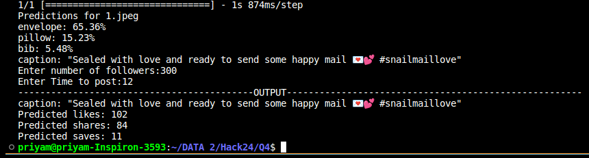

# Instagram Caption and Engagement Prediction

This project involves predicting Instagram caption for an image using a language model and estimating engagement metrics (likes, shares, saves) based on the predicted caption and other factors.




## Overview

The project consists of the following components:

1. **Image Classification:** The provided image is classified using a pre-trained InceptionV3 model to identify the main object in the image.

2. **Caption Generation:** Based on the predicted class of the image, a free language model API generates an Instagram caption.

3. **Engagement Prediction:** Regression models are employed to predict the number of likes, shares, and saves for the post, considering factors such as the number of followers, time of posting, and the identified object in the image.

## Requirements

- Python 3.x
- TensorFlow
- NumPy
- Pandas
- Scikit-learn
- OpenAI's GPT (for free language model)
- InceptionV3 pre-trained model
- dotenv (for managing environment variables)

## Installation


1. Install the required dependencies:

    ```bash
    pip install -r requirements.txt
    ```


## Usage

1. Run the script `main.py` and provide inputs:

    ```bash
    python3 main.py
    ```

    This will classify the image, generate an Instagram caption, and predict engagement metrics.

2. Follow the on-screen prompts to input the number of followers and the time of posting.

## File Structure

- `main.py`: Main script. (RUN this only)
- `reached.py`: development script for predicting image class, generating caption, and predicting engagement metrics.
- `README.md`: This file providing an overview of the project.
- `requirements.txt`: List of dependencies.
- Other files: Language model, regression models, and image classification model.

## License

This project is licensed under the MIT License - see the [LICENSE](LICENSE) file for details.

